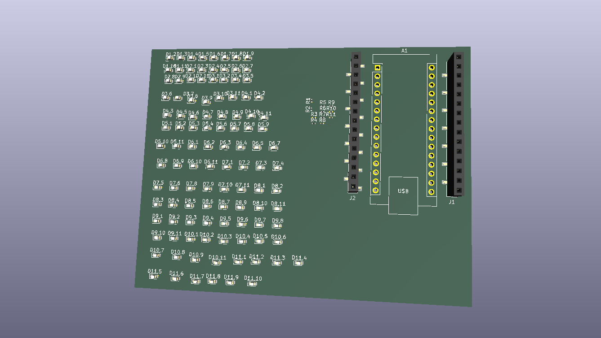
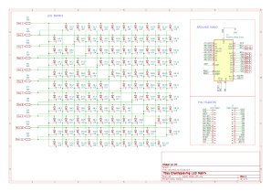

# LED Matrix PCB

A compact LED matrix prototyping board driven by an **Arduino Nano** using **charlieplexing** to control a large number of LEDs with minimal I/O pins.

## Status: 🚧 In Progress
- [x] Schematic complete
- [x] PCB layout complete
- [x] Fabrication files generated (JLCPCB) — parts ordered
- [ ] Testing

## Preview

### PCB View

> v1 design complete. Parts ordered from JLCPCB.

### Schematic

## Hardware
| Component | Details |
|-----------|---------|
| MCU | Arduino Nano |
| LED driver | Charlieplexing |
| Version | v1 |
